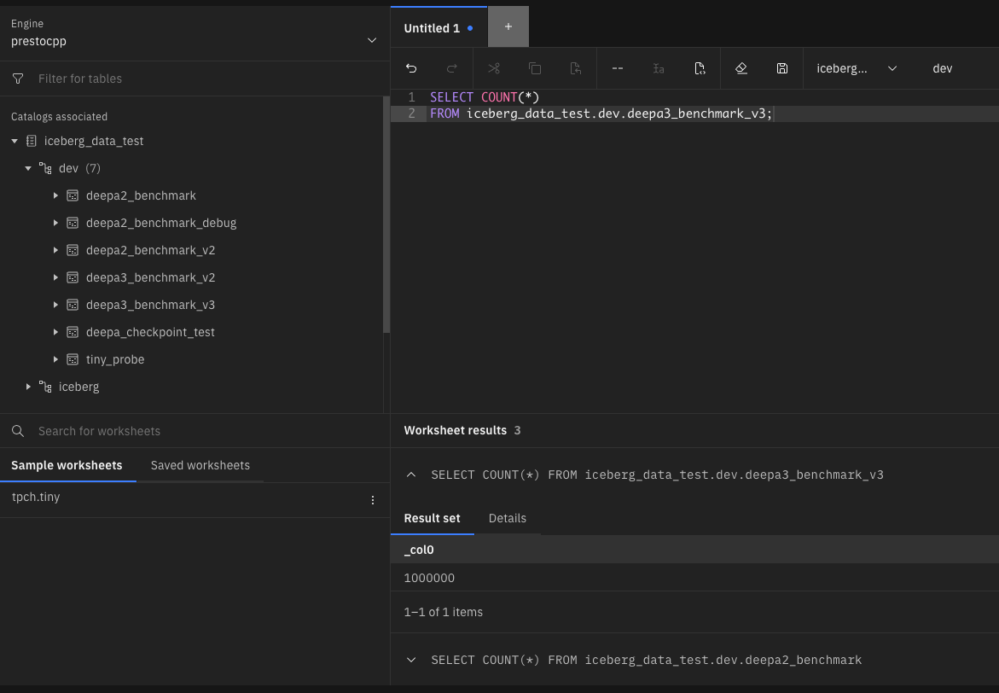

# README — Spark Iceberg Refactor Benchmark Results

## Benchmark Dataset

A synthetic benchmark dataset was generated to evaluate the Spark SQL refactor under a larger workload.

### Dataset location

```
s3://mike-apptio-spark-test-2026/debug/big_test_input/
```

### Dataset characteristics

| Metric                               | Value     |
| ------------------------------------ | --------- |
| Parquet files                        | 16        |
| Total objects (including `_SUCCESS`) | 17        |
| Row count                            | 1,000,000 |
| Columns                              | 10        |
| Compression                          | Snappy    |
| Storage                              | AWS S3    |

Example S3 listing:

```
debug/big_test_input/part-00000...
debug/big_test_input/part-00001...
...
debug/big_test_input/part-00015...
```

---

# Benchmark Configuration

Both pipelines were executed under identical conditions:

| Parameter       | Value              |
| --------------- | ------------------ |
| Spark Engine    | watsonx.data Spark |
| Storage         | AWS S3             |
| Catalog         | Apache Iceberg     |
| Dataset         | big_test_input     |
| Rows            | 1,000,000          |
| Parquet files   | 16                 |
| Executors       | 2                  |
| Executor memory | 8 GB               |
| Executor cores  | 2                  |

---

# Pipeline Comparison

Two implementations were benchmarked:

| Pipeline   | Implementation                            |
| ---------- | ----------------------------------------- |
| **deepa2** | PySpark DataFrame transformation pipeline |
| **deepa3** | Spark SQL refactored pipeline             |

Both pipelines perform the same logical steps:

1. Read Parquet data from S3
2. Normalize column casing
3. Flatten nested structures
4. Prepare output schema
5. Write Iceberg table to S3

---

# Benchmark Results

Runtime Comparison (seconds)

deepa2 (DataFrame)   | ███████████████████████████████████████ 65.22s
deepa3 (Spark SQL)   | ████████████████████████████████████    60.52s

## Runtime Visualization

Pipeline Runtime Comparison

deepa2  ██████████████████████████████████████████████████ 65.22 sec
deepa3  ██████████████████████████████████████████████     60.52 sec

Improvement: ~7.2%

## Runtime Comparison

| Stage             | deepa2 (DataFrame) | deepa3 (Spark SQL) |
| ----------------- | ------------------ | ------------------ |
| Create database   | 4.29 sec           | 4.54 sec           |
| Read parquet      | 21.09 sec          | 21.10 sec          |
| Lowercase columns | 0.34 sec           | 0.82 sec           |
| Flatten structs   | 1.66 sec           | 0.81 sec           |
| Prepare output    | 0.00 sec           | 0.16 sec           |
| Write Iceberg     | 26.01 sec          | 27.29 sec          |
| **Total runtime** | **65.22 sec**      | **60.52 sec**      |

---

# Performance Improvement

```
deepa2 runtime = 65.22 seconds
deepa3 runtime = 60.52 seconds
```

Overall improvement:

```
7.2% faster total runtime
```

```
(65.22 - 60.52) / 65.22 = 7.2%
```

---

# Observations

### Read performance

Parquet read performance was identical between both pipelines.

```
~21 seconds
```

This confirms that the refactor did not introduce any regression in I/O performance.

---

### Flatten stage improvement

The SQL implementation performed noticeably better in the struct flattening step.

| Stage           | deepa2   | deepa3   |
| --------------- | -------- | -------- |
| Flatten structs | 1.66 sec | 0.81 sec |

This suggests that pushing the transformation logic into Spark SQL allows Spark's Catalyst optimizer to generate a more efficient execution plan.

---

### Iceberg write

Iceberg write performance remained similar between both implementations.

| Pipeline | Iceberg write |
| -------- | ------------- |
| deepa2   | 26.01 sec     |
| deepa3   | 27.29 sec     |

The majority of runtime is spent writing files and committing Iceberg metadata.

---

# Final Result

The Spark SQL refactor (`deepa3`) achieved:

```
7.2% faster total runtime
```

while maintaining identical output:

* same row counts
* same schema
* valid Iceberg tables

Tables created:

```
iceberg_data_test.dev.deepa2_benchmark_v2
iceberg_data_test.dev.deepa3_benchmark_v3
```

---

# Refactor Benefits

Beyond performance improvements, the Spark SQL refactor also provides:

### Simpler transformation logic

The refactored pipeline moves transformation logic from Python recursion into declarative SQL stages.

### Improved maintainability

SQL transformations are easier to review and maintain compared with nested DataFrame operations.

### Better Spark optimization

Spark SQL transformations benefit from Catalyst query optimization.

### Reduced Python orchestration

Less driver-side logic results in a cleaner execution pipeline.

---

# Screenshots


Example validation query:

The Iceberg tables generated by both pipelines were successfully queried in the watsonx.data query workspace.

```sql
SELECT COUNT(*)
FROM iceberg_data_test.dev.deepa3_benchmark_v2;
```


```sql
SELECT COUNT(*)
FROM iceberg_data_test.dev.deepa3_benchmark_v3;
```


---

# Conclusion

The Spark SQL refactor successfully reproduces the functionality of the original DataFrame pipeline while improving maintainability and delivering a measurable performance improvement.

The refactored pipeline is recommended as the preferred implementation moving forward.

